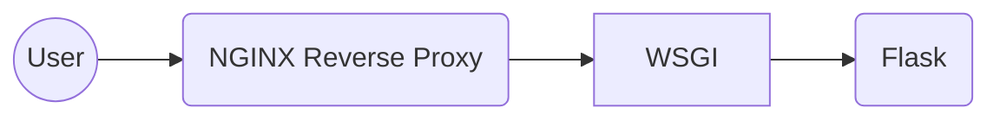

# Recipes Docker Compose



This contains all of the resources needed to run a docker compose for the entire server infrastructure of my self-titled domain.

[compose.yaml](compose.yaml) is the core of the project and contains the most interesting info.

All of the website logic is driven by a Flask app which is stored at [the following repo.](https://github.com/volutus/recipes-flask)

I've updated the sample to also include a postgres database which I'll be integrating into the flask app. 

## All Setup Steps for fresh VPS (in order)

Once the VPS was available, I signed in as root and updated apt:

`apt update && apt upgrade`

Afterwards, I went to the [Docker install instructions for Linux](https://docs.docker.com/engine/install/debian/#install-using-the-repository) and used the install instructions using the repository.

```bash
# Add Docker's official GPG key:
sudo apt-get update
sudo apt-get install ca-certificates curl
sudo install -m 0755 -d /etc/apt/keyrings
sudo curl -fsSL https://download.docker.com/linux/debian/gpg -o /etc/apt/keyrings/docker.asc
sudo chmod a+r /etc/apt/keyrings/docker.asc

# Add the repository to Apt sources:
echo \
  "deb [arch=$(dpkg --print-architecture) signed-by=/etc/apt/keyrings/docker.asc] https://download.docker.com/linux/debian \
  $(. /etc/os-release && echo "$VERSION_CODENAME") stable" | \
  sudo tee /etc/apt/sources.list.d/docker.list > /dev/null
sudo apt-get update
```

```bash
sudo apt-get install docker-ce docker-ce-cli containerd.io docker-buildx-plugin docker-compose-plugin
```

After this, I ran the test script which worked.

```bash
sudo docker run hello-world
```

To finish the setup, I created a working directory, cloned the project, and ran the update shell script.
```bash
cd /opt/
git clone https://github.com/volutus/recipes-docker
cd recipes-docker
source full-update.sh
```

I had to make several updates to the Flask app to dockerize it and prepare it for the server environment, but this wasn't too hard since I could use the existing self-domain image.

> Added Dockerfile with Flask image

> Added requirements.txt file

> Added gunicorn to requirements (not needed for local development)

To process any updates, just run the full-update.sh script. This results in 10-20 seconds of downtime, but this application hardly justifies a proper rollout script at its current scale.