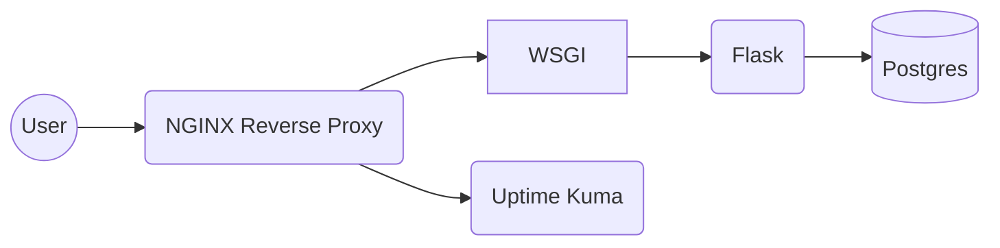

# Self-Domain Docker Compose

This contains all of the resources needed to run a docker compose for the entire server infrastructure of my self-titled domain.

[compose.yaml](compose.yaml) is the core of the project and contains the most interesting info.

All of the website logic is driven by a Flask app which is stored at [the following repo.](https://github.com/volutus/self-domain-flask)

I've updated the sample to also include a postgres database which I'll be integrating into the flask app. 